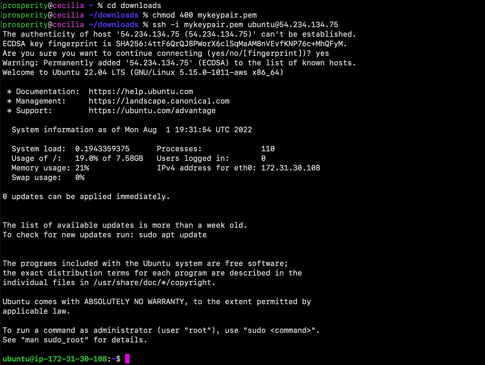
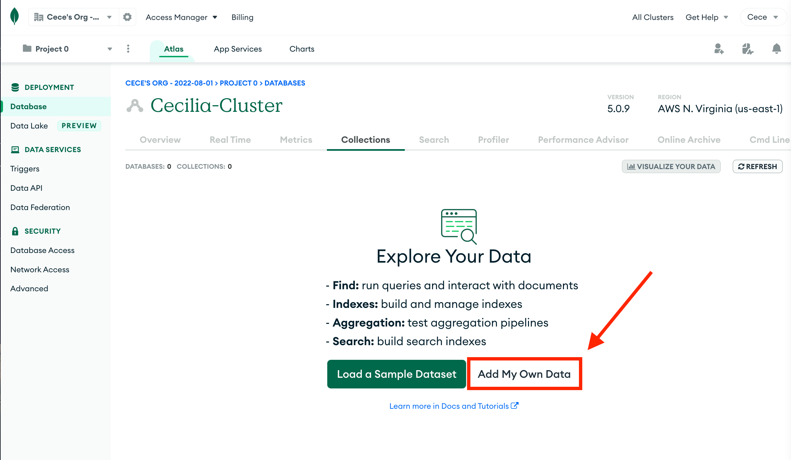
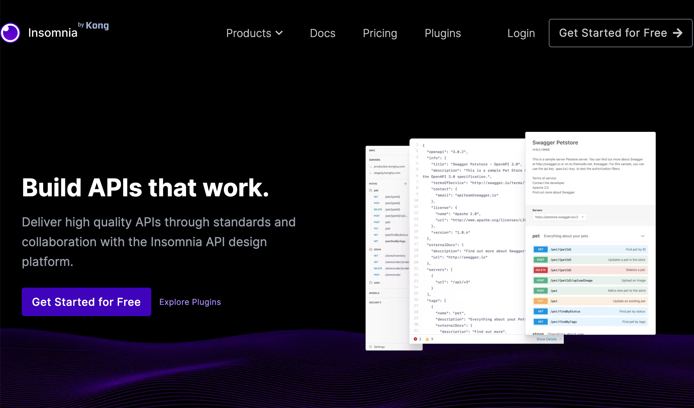

## **_MERN Web Stack_**
------------------------------------------------------------
### Overview

Hello and welcome! My name is Cecilia, and in this amazing project, I will demonstrate how to implement a web solution based on MERN stack in AWS Cloud. The **MERN** Web stack consists of following components:

- [MongoDB](https://www.mongodb.com/): A document-based, No-SQL database used to store application data in a form of documents.
- [ExpressJS](https://expressjs.com/): A server side Web Application framework for Node.js.
- [ReactJS](https://reactjs.org/): A frontend framework developed by Facebook. It is based on [JavaScript](https://www.javascript.com/), used to build User Interface (UI) components.
- [Node.js](https://nodejs.org/en/): A JavaScript runtime environment. It is used to run JavaScript on a machine rather than in a browser.

A user interacts with the ReactJS UI components at the application front-end residing in the browser. This frontend is served by the application backend residing in a server, through ExpressJS running on top of NodeJS. Any interaction that causes a data change request is sent to the NodeJS based Express server, which grabs data from the MongoDB database if required, and returns the data to the frontend of the application, which is then presented to the user.

--------------------------------------------------------------------------------------------------------------------

### Getting Started

In order to complete this project you will need the following:
- An **AWS account** to create a virtual server running Ubuntu Server OS.
- **Node.js** installed on the server
- **Insomnia** or your preferred client for testing APIs.
- A code editor, such as **VS Studio Code**

--------------------------------------------------------------------------
### PART 1: Backend configuration

On the AWS management console, navigate to the EC2 Dashboard and launch an instance with an Ubuntu 22.04 LTS (HVM) image and t2.nano storage.


Once the instance reaches a running state, navigate to your Terminal and use the downloaded key pair to securely connect to the remote server.



Now that we have connected to the server, update the Ubuntu packages using the following command:

```
$ sudo apt update
```

Next, upgrade the server using the following command. When prompted, *Do you want to continue?* selected **Y** for  Yes.

```
$ sudo apt upgrade
```

If necessary, you may restart the server using the following command:

```
$ sudo reboot now
```

In the following steps, we will install NodeJS. 

Retrieve the location of Node.js software from [Ubuntu repositories](https://github.com/nodesource/distributions#deb):

```
$ curl -sL https://deb.nodesource.com/setup_12.x | sudo -E bash -
```

Next, install Node.js with the command below:

```
$ sudo apt-get install -y nodejs
```


***Please Note**: The command above installs both `nodejs` and `npm`.*

Verify the node installation with the command below:

```
$ node -v
```

Similarly, verify the npm installation with the command below:

```
$ npm -v
```

The image below shows an example of the outputs:


### PART 2: Application Code Setup

Next, let's begin to setup the application code. Create a new directory for your To-Do project:

```
$ mkdir Todo
```

To verify that the `Todo` directory is created, use the `ls` command:

```
$ ls
```

Next, change your current directory to the newly created one:

```
$ cd Todo
```


Next, use the command `npm init` to initialize the project. (This will create a new file named `package.json`, which contains application and the dependencies that it needs to run): 

```
$ npm init
```

Follow the prompts after running the command. You can press `Enter` several times to accept default values, then accept to write out the `package.json` file by typing `yes`.

Lastly, run the command `ls` to confirm that you have package.json file created.

```
$ ls
```


Next, we will install a series of files and tools. **Express** is a framework for Node.js. Install Express using npm:

```
$ npm install express
```

Net, create a file named `index.js` with the command below:

```
$ touch index.js
```

Next, install the `dotenv` module:

```
$ npm install dotenv
```


Open the index.js file with the command below:

```
$ vi index.js
```

Add the following code and then save/write the file using `:w`. Then, use `:qa` to exit vim:

```
const express = require('express');
require('dotenv').config();

const app = express();

const port = process.env.PORT || 5000;

app.use((req, res, next) => {
res.header("Access-Control-Allow-Origin", "\*");
res.header("Access-Control-Allow-Headers", "Origin, X-Requested-With, Content-Type, Accept");
next();
});

app.use((req, res, next) => {
res.send('Welcome to Express');
});

app.listen(port, () => {
console.log(`Server running on port ${port}`)
});
```


You may have noticed that we have specified to use port `5000` in the code. This will be required later when we go on the browser.

Now it is time to start our server to see if it works! Open your terminal in the same directory as your index.js file and type:

```
$ node index.js
```

If every thing goes well, you should see **Server running on port 5000** in your terminal.


Great job!

Now we need to open this port in EC2 Security Groups. On the AWS management console, navigate to the security groups of the running Ubuntu instance. Create an inbound rule to open TCP port 5000, as shown below:


Next, open up your web browser and access your server's Public IP address, followed by port 5000:

```
http://<PublicIP-or-PublicDNS>:5000
```


--------------------------------------------------------------------------------

### PART 3: Creating the Routes
There are three functions that our To-Do application must be able achieve:

1.  Create a new task
2.  Display a list of all tasks
3.  Delete a completed task

Each task will be associated with a particular endpoint. We will create [`routes`](https://expressjs.com/en/guide/routing.html), which will define various endpoints that the `To-do` app will depend on. 

Let's begin! Create a folder called `routes`:

```
$ mkdir routes
```

Next, change directory to `routes` folder.

```
$ cd routes
```

Now, create a file `api.js` with the command below:

```
$ touch api.js
```

Open the file with the command below:

```
$ vi api.js
```

Add the code below into the file.
This will provide placeholder routes for `GET`, `POST`, and `DELETE`:

```
const express = require ('express');
const router = express.Router();

router.get('/todos', (req, res, next) => {

});

router.post('/todos', (req, res, next) => {

});

router.delete('/todos/:id', (req, res, next) => {

})

module.exports = router;
```


### PART 4: Defining the Models

In this section, we will create a model. A model is at the heart of JavaScript based applications, and it is what makes it interactive. We are creating a model because the app we're making will use [MongoDB](https://www.mongodb.com/), which is a NoSQL database.


The models will also be used to define the database schema, which is essentially a blueprint of how the database will be constructed.

To create a Schema and a model, we will install *[Mongoose](https://mongoosejs.com/)* which is a Node.js package that makes working with MongoDB easier.

Change directory back into your **Todo** folder using  `cd ..`, then install *Mongoose* using the following command:

```
$ npm install mongoose
```


Next, create a new folder:

```
$ mkdir models
```

Change directory into the newly created 'models' folder:

```
$ cd models
```

Inside the models folder, create a file and name it `todo.js`:

```
$ touch todo.js
```

Next, open the file created with the following command:

```
$ vim todo.js
```

Add the code below into the file:

```
const mongoose = require('mongoose');
const Schema = mongoose.Schema;

//create schema for todo
const TodoSchema = new Schema({
action: {
type: String,
required: [true, 'The todo text field is required']
}
})

//create model for todo
const Todo = mongoose.model('todo', TodoSchema);

module.exports = Todo;
```


Next, we need to update our routes from the file `api.js` in 'routes' directory to make use of the new model.

In the Routes directory, open api.js:

```
$ vim api.js
```
Next, delete the code inside with `:%d` command, and then add the code below:

```
const express = require ('express');
const router = express.Router();
const Todo = require('../models/todo');

router.get('/todos', (req, res, next) => {

//this will return all the data, exposing only the id and action field to the client
Todo.find({}, 'action')
.then(data => res.json(data))
.catch(next)
});

router.post('/todos', (req, res, next) => {
if(req.body.action){
Todo.create(req.body)
.then(data => res.json(data))
.catch(next)
}else {
res.json({
error: "The input field is empty"
})
}
});

router.delete('/todos/:id', (req, res, next) => {
Todo.findOneAndDelete({"_id": req.params.id})
.then(data => res.json(data))
.catch(next)
})

module.exports = router;
```


### PART 5: Connecting to the MongoDB Database

In this section, we will create a database to store our data. To achieve this, we will make use of **mLab**. mLab provides MongoDB database as a service solution ([DBaaS](https://en.wikipedia.org/wiki/Cloud_database)).

Sign up on their website for a shared clusters free account: [Sign up here](https://www.mongodb.com/atlas-signup-from-mlab). 


After you have completed the sign up process, navigate to the **Clusters** section. Select **AWS** as the cloud provider, and choose a region near you.


Complete the **Get Started** checklist as shown on the image below:


In the *Network Access* section, ensure that you allow access to the MongoDB database from anywhere (IP address 0.0.0.0).

**IMPORTANT NOTE** Also be sure to change the time of deleting the entry from 6 Hours to 1 Week.


As you create the MongoDB database and collection inside mLab, select add your own data.



Copy the connection string, and temporarily set it aside on a separate notepad.


Next, we need to update the `index.js` to reflect the use of `.env` so that Node.js can connect to the database.

Create a file in your `Todo` directory and name it `.env`:

```
$ touch .env
$ vi .env
```
Add the connection string that you copied from the mlab website. It should resemble the following format:

```
DB = 'mongodb+srv://<username>:<password>@<network-address>/<dbname>?retryWrites=true&w=majority'
```
***Please Note**: Ensure to update `<username>`, `<password>`, `<network-address>` and `<database>` according to your setup.*

Next, modify the `index.js` file by deleting the existing content in the file, and then updating the code. Follow the steps below: 

  - Open the file with `vim index.js`
  - Press `esc`
  - Type `:`
  - Type `%d`
  - Press `Enter` on your keyboard

The entire content will be deleted. Next, continue following the steps below:

  - Press `i` to enter the *insert* mode in *vim*
  - Add the entire code below into the file:

```
const express = require('express');
const bodyParser = require('body-parser');
const mongoose = require('mongoose');
const routes = require('./routes/api');
const path = require('path');
require('dotenv').config();

const app = express();

const port = process.env.PORT || 5000;

//connect to the database
mongoose.connect(process.env.DB, { useNewUrlParser: true, useUnifiedTopology: true })
.then(() => console.log(`Database connected successfully`))
.catch(err => console.log(err));

//since mongoose promise is depreciated, we overide it with node's promise
mongoose.Promise = global.Promise;

app.use((req, res, next) => {
res.header("Access-Control-Allow-Origin", "\*");
res.header("Access-Control-Allow-Headers", "Origin, X-Requested-With, Content-Type, Accept");
next();
});

app.use(bodyParser.json());

app.use('/api', routes);

app.use((err, req, res, next) => {
console.log(err);
next();
});

app.listen(port, () => {
console.log(`Server running on port ${port}`)
});
```


Start your server using the command:

```
$ node index.js
```


You should see the following message **"Database connected successfully"**. Great job! We have configured the backend.

------------------------------------------------------------------------------------
### Part 6: Testing Backend Code using RESTful API

In this section, we will test our code using RESTful (representational state transfer) API. Therefore, we will need to make use of some API development client to test our code.

For this project, we will use [Insomnia](https://insomnia.rest/) to test our API. Click **[Install Insomnia](https://insomnia.rest/download)** to download and install Insomnia on your machine.



It is important to test all the API endpoints to ensure that they are working. 

Begin by opening Insomnia, and creating a create a `POST` request to the following API:

```
http://<PublicIP-or-PublicDNS>:5000/api/todos
```

This request sends a new task to our To-Do list, so that the application could store it in the database. In my example, I added tbe following tasks in my To-Do list:
   - build a mern stack application
   - learn a new language

***Please Note:** make sure your set header key `Content-Type` as `application/json`*

Next, create a `GET` request to your API: ` http://<PublicIP-or-PublicDNS>:5000/api/todos`

This request retrieves all existing records from our To-do application (backend requests these records from the database and sends it us back as a response to `GET` request).


To send a `DELETE` request to delete a task from out To-Do list, simply send its ID as a part of DELETE request. 

For example: 

```
DELETE localhost:5000/api/todos/5bd4edfc89d4c3228e1bbe0ad
```


Great job! We have successfully tested backend part of our To-Do application and have made sure that it supports all three operations we wanted:

-   [x] POST request - Adds a new task to the list
-   [x] GET request - Displays a list of tasks
-   [x] DELETE request - Deletes an existing task from the list


----------------------------------------------------------------------------------------------------------------------------------------

### PART 7: Creating the Frontend 

In this section, we will create a user interface for a web client (browser) to interact with the application via API. To start out with the frontend of the To-do app, we will use the `create-react-app` command to scaffold our app.

On your terminal, navigate to the same root directory as your backend code (which is the Todo directory) and run the following command:

```
$ npx create-react-app client
```


This will automatically create a new folder in your `Todo` directory called `client`, where you will add all the react code.

-----------------------------------------------------------------------------
### PART 8: Running a React App

Before testing the react app, there are several dependencies that need to be installed.

First, install [concurrently](https://www.npmjs.com/package/concurrently). It is used to run more than one command simultaneously from the same terminal window.

```
$ npm install concurrently --save-dev
```


Next, install [nodemon](https://www.npmjs.com/package/nodemon). It is used to run and monitor the server. If there is any change in the server code, nodemon will restart it automatically and load the new changes.

```
$ npm install nodemon --save-dev
```

In `Todo` folder open the `package.json` file. Change the highlighted part of the below screenshot and replace with the code below.

```
"scripts": {
"start": "node index.js",
"start-watch": "nodemon index.js",
"dev": "concurrently \"npm run start-watch\"  \"cd client && npm start\""
},
```


Next, configure the proxy in `package.json`. Begin by changing directory into the 'client' folder:

```
$ cd client
```
Next, open the `package.json` file:

```
$ vi package.json
```

Add the key value pair in the package.json file:

```
"proxy": "http://localhost:5000"
```


The proxy configuration makes it possible to access the application directly from the browser by simply calling the server url like `http://localhost:5000` rather than using the entire path `http://localhost:5000/api/todos`

Lastly, from the `Todo` directory on your Terminal, run the following command:

```
$ npm run dev
```


Your app should open and start running on `http://<PublicIP-or-PublicDNS>:3000`


-------------------------------------------------------------------------------------
### PART 9: Creating your React Components

One of the advantages of React is that it makes use of components, which are reusable and also makes code modular. For your todo app, there will be two state components and one stateless component.

From the Terminal, navigate to your Todo directory and run the following command:

```
$ cd client
```

Next, move to the src directory:

```
$ cd src
```
Inside your `src` folder create another folder called `components`.

```
$ mkdir components
```
Move into the components directory:

```
$ cd components
```

Next, navigate to the 'components' directory and create three files `Input.js`, `ListTodo.js` and `Todo.js`.

```
$ touch Input.js ListTodo.js Todo.js
```
Open the `Input.js` file:

```
$ vi Input.js
```

Add the following code:

```
import React, { Component } from 'react';
import axios from 'axios';

class Input extends Component {
  state = {
    action: '',
  };

  addTodo = () => {
    const task = { action: this.state.action };

    if (task.action && task.action.length > 0) {
      axios
        .post('/api/todos', task)
        .then((res) => {
          if (res.data) {
            this.props.getTodos();
            this.setState({ action: '' });
          }
        })
        .catch((err) => console.log(err));
    } else {
      console.log('input field required');
    }
  };

  handleChange = (e) => {
    this.setState({
      action: e.target.value,
    });
  };

  render() {
    let { action } = this.state;
    return (
      <div>
        <input type="text" onChange={this.handleChange} value={action} />
        <button onClick={this.addTodo}>add todo</button>
      </div>
    );
  }
}

export default Input;
```

[Axios](https://github.com/axios/axios) is a Promise based HTTP client for the browser and node.js.

From the Terminal, navigate into the `clients` folder using the `cd` command. Once you have reached the `clients` folder, install Axios:

```
$ npm install axios
```


Navigate to 'components' directory:

```
$ cd src/components
```
Next, open your `ListTodo.js`:

```
$ vi ListTodo.js
```

in the `ListTodo.js` add the following code:

```
import React from 'react';

const ListTodo = ({ todos, deleteTodo }) => {
  return (
    <ul>
      {todos && todos.length > 0 ? (
        todos.map((todo) => {
          return (
            <li key={todo._id} onClick={() => deleteTodo(todo._id)}>
              {todo.action}
            </li>
          );
        })
      ) : (
        <li>No todo(s) left</li>
      )}
    </ul>
  );
};

export default ListTodo;
```

Next, we must modify the React code. Move to the src folder using the `cd` command.

While inside the src folder, run the following command:

```
$ vi App.js
```

Add the code below into it:

```
import React from 'react';

import Todo from './components/Todo';
import './App.css';

const App = () => {
return (
<div className="App">
<Todo />
</div>
);
}

export default App;
```

Next, in the src directory open the `App.css`

```
$ vi App.css
```

Then, add the following code into `App.css`:

```
.App {
  text-align: center;
  font-size: calc(10px + 2vmin);
  width: 60%;
  margin-left: auto;
  margin-right: auto;
}

input {
  height: 40px;
  width: 50%;
  border: none;
  border-bottom: 2px #101113 solid;
  background: none;
  font-size: 1.5rem;
  color: #787a80;
}

input:focus {
  outline: none;
}

button {
  width: 25%;
  height: 45px;
  border: none;
  margin-left: 10px;
  font-size: 25px;
  background: #101113;
  border-radius: 5px;
  color: #787a80;
  cursor: pointer;
}

button:focus {
  outline: none;
}

ul {
  list-style: none;
  text-align: left;
  padding: 15px;
  background: #171a1f;
  border-radius: 5px;
}

li {
  padding: 15px;
  font-size: 1.5rem;
  margin-bottom: 15px;
  background: #282c34;
  border-radius: 5px;
  overflow-wrap: break-word;
  cursor: pointer;
}

@media only screen and (min-width: 300px) {
  .App {
    width: 80%;
  }

  input {
    width: 100%
  }

  button {
    width: 100%;
    margin-top: 15px;
    margin-left: 0;
  }
}

@media only screen and (min-width: 640px) {
  .App {
    width: 60%;
  }

  input {
    width: 50%;
  }

  button {
    width: 30%;
    margin-left: 10px;
    margin-top: 0;
  }
}
```

Next, in the src directory open the `index.css`:

```
$ vi index.css
```

Add the following code below:

```
body {
  margin: 0;
  padding: 0;
  font-family: -apple-system, BlinkMacSystemFont, "Segoe UI", "Roboto", "Oxygen", "Ubuntu", "Cantarell", "Fira Sans", "Droid Sans", "Helvetica Neue", sans-serif;
  -webkit-font-smoothing: antialiased;
  -moz-osx-font-smoothing: grayscale;
  box-sizing: border-box;
  background-color: #282c34;
  color: #787a80;
}

code {
  font-family: source-code-pro, Menlo, Monaco, Consolas, "Courier New", monospace;
}
```

Next, use the `cd` command to go to the Todo directory. When you are in the Todo directory run:

```
$ npm run dev
```


Assuming no errors when saving all these files, our To-Do app should be ready and fully functional with the functionality discussed earlier: creating a task, deleting a task and viewing all your tasks.


--------------------------------------------------------------------------------------------------------------------

### PART 10: Clean Up

To avoid incurring future charges, delete all of the resources!

On the AWS Management Console, navigate to the EC2 Dashboard and terminate the Ubuntu EC2 instance.


Next, visit the [mLab](https://www.mongodb.com/atlas-signup-from-mlab) website and terminate the database.


----------------------------------------------------------------------

Wonderful job! Thank you for viewing my project and following along. I demonstrated how to create a simple To-Do and deploy it to MERN stack. First, we wrote a frontend application using React.js that communicates with a backend application written using ExpressJS. Next, we created a Mongodb backend for storing tasks in a database.

I hope you enjoyed it! For more details on similar projects and more, please visit my GitHub portfolio: https://github.com/ceciliacloud


